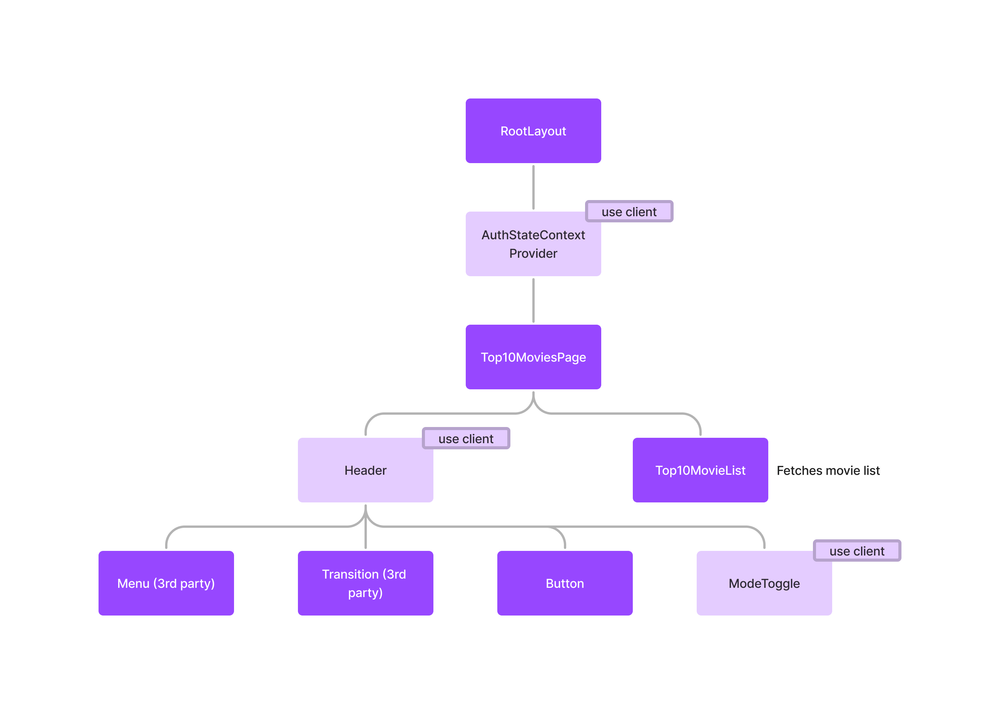

# Movie Magic 2

A sample application to demonstrate the use of basic UI components such as
buttons, forms and lists.

Live demo: https://movie-magic-2-movie-magic-nextjs.vercel.app/

### Home Page


### Sign In Form


### Top 10 Movies


Here's the component hierarchy for the "Top 10 Movies" page. Note how the client
and server components are interleaved.



## Building Movie Magic 2

### Development Build

```shell
# Run ci in the root directory to install dependencies
npm ci

# Run a full build to make sure libraries are available to the apps
npm run build

# Run the apps
npm run dev
```

Open a browser window at http://localhost:3000/ to see app.

1. Click `Sign In` on the home page to sign in.
2. Type in any email address and password on the sign-in page. The values don't
   matter. They are not checked. Click on the `Sign in` button.
3. You are redirected to the "Top 10 Movies" page. Click on the avatar in the
   header and select "Sign out" from the drop-down menu. You will be signed out
   and redirected to the home page.

Note that you can bypass the login flow to see the "Top 10 Movies" page
directly. Just point your browser to http://localhost:3000/top-10-movies.

> Note: Do not run `npm install` or `npm ci` in any of the subdirectories. It
> will break the build. There should be only one `package-lock.json` file in the
> entire repo (at the root).
