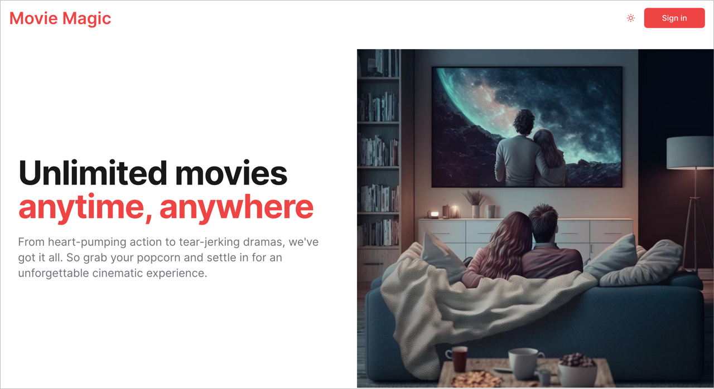
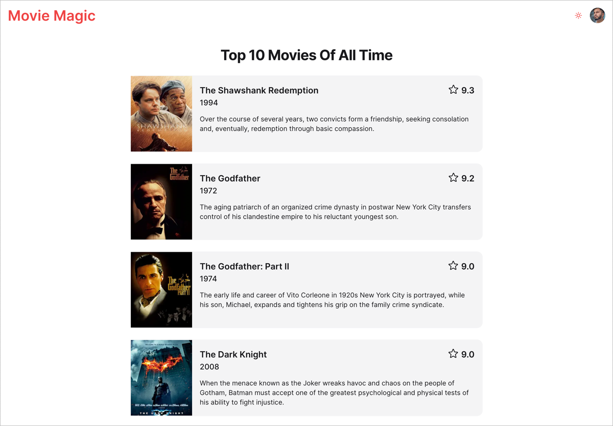

# Movie Magic 2

A sample application to demonstrate the use of basic UI components such as
buttons, forms and lists.

### Home Page



### Sign In Form


### Top 10 Movies



## Building Movie Magic 2

### Development Build

```shell
# Run ci in the root directory to install dependencies
npm ci

# Run a full build to make sure libraries are available to the apps
npm run build

# Run the apps
npm run dev
```

Open browser windows at http://localhost:3000/ to see app.

> Note: Do not run `npm install` or `npm ci` in any of the subdirectories. It
> will break the build. There should be only one `package-lock.json` file in the
> entire repo (at the root).
